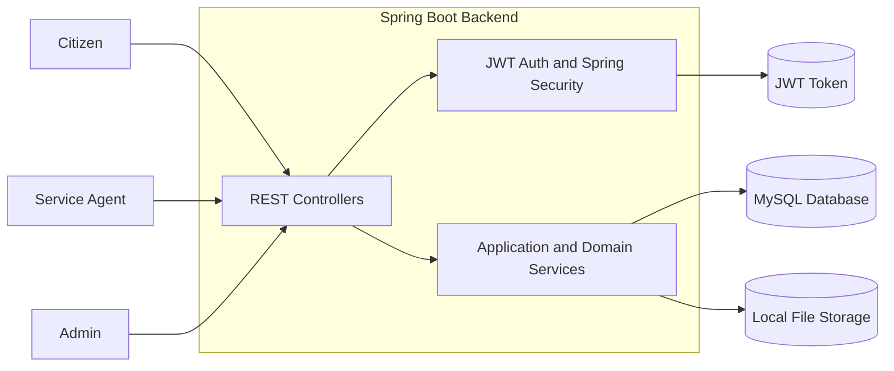
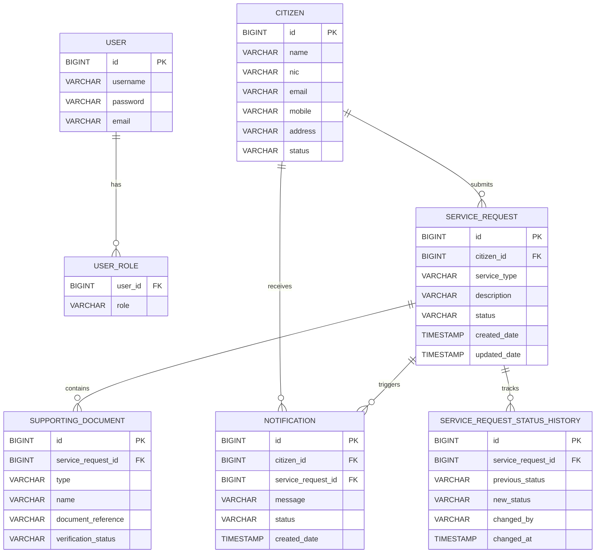
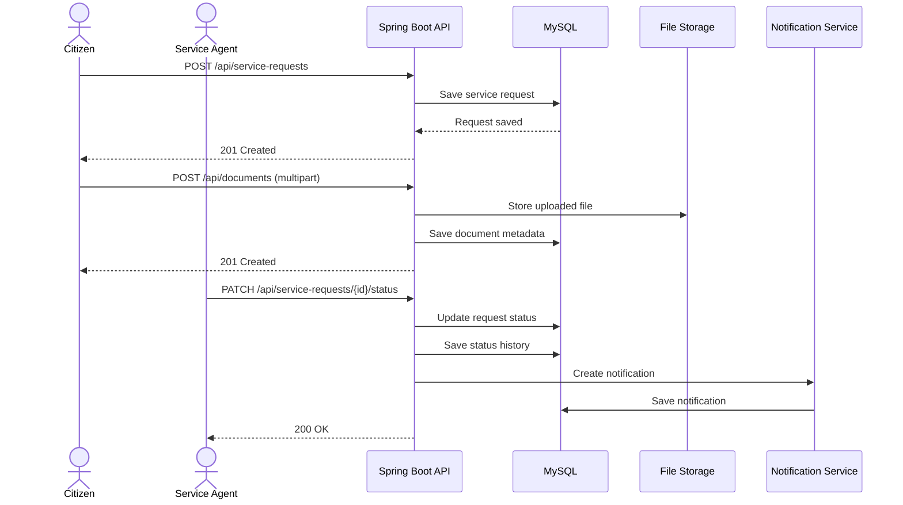

# Government Service Request Platform Backend

Spring Boot backend for a Digital Government Service Request Platform. The system supports three actors:
- `CITIZEN` — submits service requests, uploads supporting documents, and checks notifications.
- `SERVICE_AGENT` — reviews requests/documents and updates statuses.
- `ADMIN` — manages privileged registration, citizen lifecycle actions, and destructive operations.

## Implemented Scope

### Functional modules
- JWT authentication and role-based authorization
- Citizen profile management
- Service request submission and review
- Supporting document upload and metadata management
- Citizen notifications
- Service request status history tracking

### Non-functional deliverables
- OpenAPI / Swagger UI integration
- Health endpoint via Spring Boot Actuator
- Unit test coverage for a service component
- Dockerfile and `compose.yaml`
- Postman collection and curl guides

## Tech Stack
- Java 21
- Spring Boot
- Spring Security + JWT
- Spring Data JPA
- MySQL 8
- Springdoc OpenAPI
- Spring Boot Actuator
- JUnit 5 + Mockito

## Project Structure

```text
src/main/java/com/govtech/gsrp_backend
├── application
│   ├── config
│   ├── controller
│   ├── dto
│   ├── exception
│   ├── security
│   └── service
├── domain
│   ├── entity
│   ├── enums
│   └── service
└── external
    └── repository
```

## Main Endpoints

### Auth
- `POST /api/auth/login`
- `POST /api/auth/register`
- `POST /api/auth/admin/register`
- `GET /api/auth/me`

### Citizens
- `POST /api/citizens`
- `GET /api/citizens/{id}`
- `GET /api/citizens`
- `PUT /api/citizens/{id}`
- `DELETE /api/citizens/{id}`

### Service Requests
- `POST /api/service-requests`
- `GET /api/service-requests/my`
- `GET /api/service-requests/{id}`
- `GET /api/service-requests`
- `PUT /api/service-requests/{id}`
- `PATCH /api/service-requests/{id}/status`
- `DELETE /api/service-requests/{id}`
- `GET /api/service-requests/{id}/documents`
- `GET /api/service-requests/{id}/history`

### Documents
- `POST /api/documents` (`multipart/form-data`)
- `GET /api/documents/{id}`
- `PUT /api/documents/{id}`
- `PATCH /api/documents/{id}`
- `DELETE /api/documents/{id}`

### Notifications
- `GET /api/notifications/my`
- `PATCH /api/notifications/{id}/read`

### Operational
- `GET /swagger-ui.html`
- `GET /v3/api-docs`
- `GET /actuator/health`

## Local Run

### Prerequisites
- JDK 21
- Maven 3.9+ or the Maven wrapper
- MySQL 8

### Environment variables

| Variable | Value | Purpose |
|---|---|---|
| `DB_URL` | required | Database JDBC URL |
| `DB_USERNAME` | required | Database username |
| `DB_PASSWORD` | required | Database password |
| `JWT_SECRET` | required, minimum 32 chars | JWT signing secret |
| `JWT_EXPIRATION_MS` | optional, default `86400000` | JWT expiration in ms |
| `FILE_UPLOAD_DIR` | optional, default `./uploads/documents` | Local document storage directory |
| `MAX_FILE_SIZE` | optional, default `10MB` | Max file upload size |
| `MAX_REQUEST_SIZE` | optional, default `15MB` | Max multipart request size |

Set the required variables before running locally. Example for PowerShell:

```powershell
$env:DB_URL="jdbc:mysql://localhost:3306/gsrp_db?createDatabaseIfNotExist=true&useSSL=false&serverTimezone=UTC"
$env:DB_USERNAME="root"
$env:DB_PASSWORD="your-password"
$env:JWT_SECRET="changeThisJwtSecretKeyBeforeProductionDeployment123"
```

### Run locally

```bash
./mvnw clean spring-boot:run
```

On Windows PowerShell:

```powershell
.\mvnw.cmd clean spring-boot:run
```

## Docker

### Build image

```bash
docker build -t gsrp-backend .
```

### Run full stack

```bash
docker compose up --build
```

Services:
- Backend: `http://localhost:8080`
- MySQL: `localhost:3306`

## API Documentation

- Swagger UI: `http://localhost:8080/swagger-ui.html`
- OpenAPI JSON: `http://localhost:8080/v3/api-docs`

## Visual Architecture

### Architecture Diagram



Source: `docs/diagrams/architecture.mmd`

### ER Diagram



Source: `docs/diagrams/er-diagram.mmd`

### Request Processing Sequence



Source: `docs/diagrams/sequence.mmd`

## Evaluation Screenshots

### Postman Login Request


Add the remaining screenshots at these paths to keep the README consistent:
- `docs/images/postman/postman-collection-overview.png`
- `docs/images/swagger/swagger-ui.png`
- `docs/images/docker/docker-compose-healthy.png`

## Response Contract

Successful API responses use a standard envelope:

```json
{
  "timestamp": "2026-06-21T10:00:00Z",
  "status": 200,
  "message": "Service request retrieved successfully.",
  "data": {}
}
```

Error responses use a standard envelope:

```json
{
  "timestamp": "2026-06-21T10:00:00Z",
  "status": 403,
  "error": "Forbidden",
  "message": "Access is denied",
  "path": "/api/service-requests/1"
}
```

The curl guides in `AI-Aid/postman-curl.txt` and `AI-Aid/postman-stepby-step-curl.txt` assume IDs and tokens are read from `response.data`.

## Health Check

- Health endpoint: `http://localhost:8080/actuator/health`

Expected response shape:

```json
{
  "status": "UP"
}
```

## Testing

Included test coverage:
- `src/test/java/com/govtech/gsrp_backend/domain/service/impl/NotificationListServiceImplTest.java`

Run tests:

```bash
./mvnw test
```

## Postman and Curl Assets

- Collection: `AI-Aid/GSRP-Backend-Postman-Collection.json`
- Curl guide: `AI-Aid/postman-curl.txt`
- Step-by-step flow: `AI-Aid/postman-stepby-step-curl.txt`

## Design Decisions

- JWT-based stateless authentication
- Role restrictions enforced at method level and HTTP entry level
- Structured JSON error responses for `400`, `401`, `403`, and `500`
- Status history stored in a dedicated table instead of reconstructing from notifications
- Supporting documents stored on local disk and referenced from the database
- Soft cancellation for service requests via `CANCELLED` status

## Known Gaps / Improvement Backlog

- Add broader integration tests for authorization and persistence
- Consider pagination for notifications and history
- Replace local file storage with object storage for production-grade deployment

## Assumptions

- An initial `ADMIN` user already exists or is provisioned out-of-band
- Citizens authenticate using the NIC-based account created during citizen profile creation
- Local file-system storage is acceptable for assessment scope

## Suggested Images for README

Use these images to make the repository easier to evaluate:
- **Architecture Diagram** — actors (`Citizen`, `Service Agent`, `Admin`) to backend to MySQL/file storage/JWT
- **ER Diagram** — `User`, `Citizen`, `ServiceRequest`, `SupportingDocument`, `Notification`, `ServiceRequestStatusHistory`
- **Sequence Diagram** — citizen request submission → agent review → notification generation
- **Swagger UI Screenshot** — visible API documentation
- **Docker Compose Runtime Screenshot** — backend and MySQL containers healthy
- **Postman Collection Screenshot** — organized folders for Auth, Citizens, Requests, Documents, Notifications
